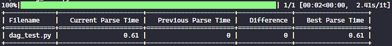
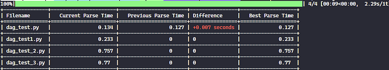

# Airflow Dag Parse Benchmarking

Stop creating bad DAGs! Use this tool to measure and compare the parse time of your DAGs, identify bottlenecks, and optimize your Airflow environment for better performance.

# How It Works

While retrieving parse metrics from an Airflow cluster is straightforward, measuring the effectiveness of your code optimizations can be less so. Every time you modify your code, you need to redeploy the updated Python file to your cloud provider, wait for the DAG to be parsed, and then extract a new report - a slow and time-consuming process.

To address this challenge, this tool simplifies measuring and comparing the parse times of your DAGs. It uses the same parse method as Airflow (taken from the Airflow repository), measures the time taken to parse the DAGs, and stores the results for further comparisons.


# Installation
It's recommended to use a [virtualenv](https://docs.python.org/3/library/venv.html) to avoid library conflicts. Once set up, you can install the package by running the following command:

```bash
pip install airflow-parse-bench
```

## Install your Airflow dependencies
The command above only installs the essential library dependencies (related to Airflow and Airflow providers). You must manually install any additional libraries your DAGs depend on.

For example, if a DAG uses ```boto3``` to interact with AWS, ensure that boto3 is installed in your environment. Otherwise, you'll encounter parse errors.

## Configure your Airflow Variables
Finally, if your DAGs use **Airflow Variables**, you must define them locally as well. Use placeholder values, as the actual values aren't required for parsing purposes. To setup Airflow Variables locally, you can use the following command:

```bash
airflow variables set MY_VARIABLE 'ANY TEST VALUE'
```
Without this, you'll encounter an error like:
```bash
error: 'Variable MY_VARIABLE does not exist'
```

# Usage
To measure the parse time of a single Python file, just run:

```bash
airflow-parse-bench --path your_path/dag_test.py
```
The image below shows the execution result:


The output table contains the following columns:
- **Filename**: The name of the Python module containing a DAG. This unique name is the key to store DAG information.
- **Current Parse Time**: The time taken to parse the DAG in seconds.
- **Previous Parse Time**: The time taken to parse the DAG in the previous run.
- **Difference**: The difference between the current and previous parse times.
- **Best Parse Time**: The best parse time recorded for the DAG.

Besides measuring the parse time of a single Python file, you can also measure the parse time of all Python files in a directory. To do so, run:

```bash
airflow-parse-bench --path your_path/your_dag_folder
```
This time, the output table will present the parse times of all Python files in the directory:


In addition, the library supports some additional arguments to customize the results. To see all available options, run:

```bash
airflow-parse-bench --help
```
It will display the following options:
- **--path**: The path to the Python file or directory containing the DAGs.
- **--order**: The order in which the results are displayed. You can choose between 'asc' (ascending) or 'desc' (descending).
- **--num-iterations**: The number of times to parse each DAG. The parse time is the average of all iterations.
- **--skip-unchanged**: Skip DAGs that haven't changed since the last run.
- **--reset-db**: Clear all stored data on the local database before parsing the DAGs, starting a fresh execution.

> **Note**: If you encounter an error to parse the Python file, or if there's no valid DAGs in your file, you'll see an error message in the output and the file won't be listed in the table results.  

# Roadmap
This project is still in its early stages, and there are many improvements planned for the future. Some of the features we're considering include:

- **Parse DAGs on Cloud:** Automatically download DAGs from a cloud provider (e.g., AWS S3, Google Cloud Storage) and parse them.
- **Paralelize parse execution:** Parse multiple DAGs at the same time to speed up the process.
- **Consider .airflowignore:** Ignore files and directories specified in the .airflowignore file.

If you want to request a new feature or report a bug, please open a new issue!

# Contributing
This project is open to contributions! If you want to help us improve the tool, please follow these steps:

- Open a new issue to discuss the feature or bug you want to address.
- Once approved, fork the repository and create a new branch.
- Implement the changes.
- Create a pull request with a detailed description of the changes.